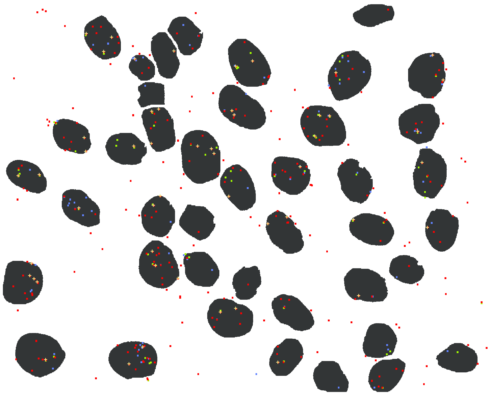

ARNColoc
========

### Tools for spots colocalisation and quantification

ARNColoc is a software suite written in matlab for RNA colocalisation, quantification and transcription site detection. ARNColoc also provide a tool (**shift**) for pixel shift detection.

The following tutorial describe step by step the use of ARNColoc to perform RNA quantification.

* * *

### Shift
 Fluorescence microscopy imaging is usually performed by sequentially acquiring image through different channels and merging them. However, deviation in the light beam of the emission filters can cause the pixels in each channel to be out of alignment, as seen in the following picture. This is called pixel shift.  
  
  
  
 **Shift** is a script that attempt to correct pixel shift based on reference image for each channel (cy5, cy3 and cy3.5). The algorithm behind is really simple and might be upgraded soon. 
  
     

   * #### Input  
    The only input files are loc files. Loc files are the usual output of spot detection programs (Airlocalize for 3D, Localize for 2D) and contains each spot coordinates and its intensity. In order to use **Shift** you need to perform spot detection using high resolution reference images obtained for each channel. 
   
   * #### Input data acquisition using Tetraspek bead images
   Cornelia Zorca from the Zenklusen lab provide a way of acquiring input data using Tetraspek bead images and Localize for spots detection :
      1. Take several Tetraspek bead images for pixel shift correction. (Tetraspek bead dilution 1/100 in TAP water; place 5ul/slide). 
      2. Open Tetraspek bead images in FIJI. Make maximum projections for each chanel (Cy3; Cy3.5 and Cy5). 
      3. Localize the spots on Tetraspek bead images using LOCALIZE.
          
   * #### Running
    Move to the directory containing the script and execute the **Shift.m** script (just type **Shift** in your matlab interpreter). The graphical interface should appear.

    1. Use the browse button to upload your file for each channel (in red)
    2. Use the channel marker to select the corresponding channel for each loc file (in blue)
    3. Select you input type. Use 2D for a 2D loc file from localize and 3D for 3D loc file from Airlocalize.  
    4. **[Optional]** Choose the file you want to correct from your two input files. The other channel will be used as reference for the pixel shifting (in green).
    
 

    5. Use the distance slider to set a limit on shfit between pixel. This is useful for pixel pairing when spots are found in one file and not the other. 
    
 
  
  
    6. Click on the "OK" button !
        
    A **.shift** file containing informations about the pixel shift will be saved in your folder. This editable file can be used in ARNColoc to correct for pixel shifting in order to provide more accurate results. It's format is really simple.
    
ref_channel - other_channel mean-x-shift mean-y-shift

    The refence channel being the one with the most spots. You should also reuse the same shift file in ARNColoc for data obtained from the same experiment.
        
* * *

### ARNColoc  

ARNColoc is the main script for RNA quantification.  
   * #### Input  
     * Segmentation file (nucleus mask). You can obtained a segmented image by manually circling the dapi signal after a 2D max projection in ImageJ or using an automatic segmentation tool like CellProfiler. 

        
        
     * At least 2 loc files ([mrna](example/input/mRNA.loc), [erna_1](example/input/s_eRNA.loc) or [erna_2](example/input/as_eRNA.loc))

   * #### Run
    Execute the **ARNColoc** script in matlab by typing **ARNColoc** in you matlab interpreter. You might need to move to the directory containing the script ot set it as your matlab home directory.  
   
    1. Load your segmented image (nucleus mask). Your image will be displayed on  *the intensity_plot frame*.
    
 

    2. Load each of your loc files using the browse button and select the corresponding channel of acquisition. ARNColoc use cyanine dyes as label for color channels. For each loc file, the intensity distribution of the spot will be displayed on the *intensity_prot frame*.
    
 
 
    3. **[Optional]** Set the transcription site coefficient (**_tc_**). This value will be use to define transcription sites. A spot will be considered as transcription site if :
    
Intensityspot > Intensitysingle x <em><strong>tc</strong></em>

The default value is 1.5
    4. **[Optional]** Set the intensity threshold to discard any spot with intensity lower than your threshold. This is useful when you suspect that there are a lot of noise in your loc file. The intensity distribution shown when loading each loc file should be helpful in setting a threshold. Keep in mind that this threshold will be applied to all your inputloc  files.
    5. **[Optional]** Set the pixel size (in nm). You can obtain this value from your microscope specs. In case of rectangular pixel, enter the average value of the length and width provided by the specs.
    6. **[Optional]** If you need to correct for pixel shifting, check  **"Pixel shift"**, upload you shift files (see [Shift](#shift)) and select the reference for the pixel shift correction (**"Shift Ref"**). Two analyses will be performed. One with your input files and another with the corrected version.
    
 

    7. If you have intronic signal (single mRNA are mostly expected to be found only out of the nuclei), check **"Intron signal"**
    8. Check **"Label Nucleus"** to label each nucleus by a number.
    9. Press **OK**.
  
    You will be asked to provided a colocalization radius (in nm) between spot from each pair of RNA type. o perform colocalisation, a RNA type will be used as reference. Use the slider to select a radius you deem appropriate. Spots will only colocalize in this radius. Press OK when you're done.
    
 

  
    After that you will be asked to select a method to compute single spot intensity for each eRNA file (sense vs anti-sense). Three methods are proposed. **(1)** mean intensity of every spot, **(2)** A 2-means intensity clustering and a **(3)** 3-means intensity clustering. 2-means clustering use a k-means clustering with 2 centroids to assign your spot in two clusters based on their intensity. The mean intensity of the cluster with the lower intensities will be used as single eRNA intensity. 3-means clustering use the cluster with intermediate intensities to comptute single eRNA intensity. Depending on you data the 3-means clustering will sometimes give inapropriate high values. Please use the intensity distribution shown to decide which method suit you data best. You should verify where the single eRNA intensity computed by each method fit in the distribution and see if that make sense. 
  
    **Enter the chosen method number (1, 2 or 3) and press OK**.
    
 

    **Some steps could be repeated for each RNA type. Please check the dialog box title to avoid being confused.**
  
    **ARNColoc save your output files in a folder named 'outputfile'**
    
    * ##### Output
    
     *  mrna.locx  s\_erna.locx and as\_erna.locx  file : Custom loc file containing information about each spot (position x ,position y , intensity, nucleus, number of nascent) 
     * trans.locx : Custom file with informations about each transcription site (position x	position y	intensity	nascents	nucleus	number of s\_erna  and number of as\_erna that colocalize with the transcription site	). I plan to use this file later to diplay transcription site on ImageJ / Imaris
     * Trans\_with\_s\_erna_.txt : A tsv file containing transcription file that colocalize with sense eRNA spots. 
     * Trans\_with\_as\_erna.txt :  A tsv file containing transcription file that colocalize with anti-sense eRNA spots. 
     * Trans\_without\_erna.txt :  A tsv file containing transcription file that do not colocalize with any eRNA spots. 
     * Trans\_coloc\_analysis.txt : A tsv file containing detailled information for each nucleus about transcription site colocalisation
     * spot\_coloc\_analysis.txt : A tsv file containing detailled information for each nucleus about spot colocalisation
     * Corr\* files :  outputs for after correcting for pixel shift.
     * An output image with each nucleus labeled (if 'Label Nucleus' was checked)  for easy recognition (mRNA spot are marked as red spots, s\_eRNA as blue spots, as\_eRNA as green spots and a yellow '+' sign is used to show transcription site).
     

