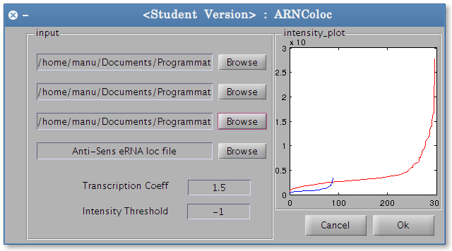
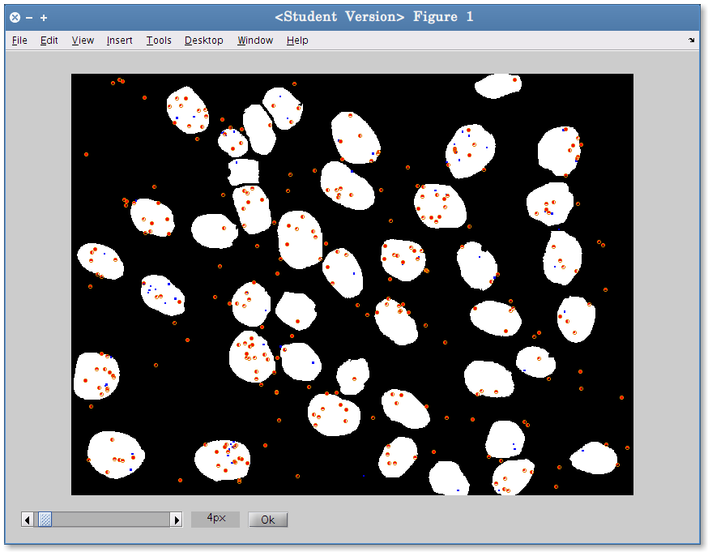

ARNColoc
========

### Tools for spots colocalisation and quantification

ARNColoc will colocalize any pair of spot and quantify the ARN present in the spot.
When user provide mRNA spot, transcription site will be detected and the analysis will be done using founded transcription site and all the spot.
Transcription site detection is based on the spot intensity and his localisation (nucleus)

* ##### Input
    
    * Segmentation file (nucleus mask)
    
        
        
    * At least 2 loc file ([mrna](example/input/mRNA.loc), [erna_1](example/input/s_eRNA.loc) or [erna_2](example/input/as_eRNA.loc))
        Loc file are the usual output of spot detection programs (Airlocalize, Localize) and contains the spot coordinates and its intensity

* ##### Running

    * Input Interface 
    
        
        
    
    * Colocalisation of 2 spots (increase/decrease the radius of colocalization according to your need)
    
        

* ##### Output
    * An output image with each nucleus labeled for easy recognition
    
        
    
    * [A list of text file that contains analysis output](example/output/)
    
    

